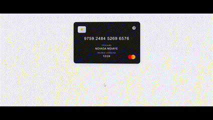

# 💳 Composant Carte de Crédit

Ce projet contient un composant React qui affiche une carte de crédit interactive. La carte de crédit peut être retournée pour montrer à la fois le recto et le verso.

## 🎬 Démonstration



## ✨ Fonctionnalités

- 🎨 Design réaliste de carte de crédit
- 🔄 Animation de retournement 3D interactive
- 📱 Mise en page responsive
- 🔧 Informations de carte personnalisables
- 🖼️ Le recto affiche :
  - 💽 Puce
  - 📡 Icône de paiement sans contact
  - 🔢 Numéro de carte
  - 👤 Nom du titulaire
  - 📅 Date d'expiration
  - 🏦 Logo de l'émetteur de la carte (Mastercard)
- 🔙 Le verso affiche :
  - 🔒 Bande magnétique
  - ✍️ Panneau de signature
  - 🔑 Numéro CVV

## 🚀 Installation

1. 📥 Clonez ce dépôt sur votre machine locale.
2. 📂 Naviguez vers le répertoire du projet.
3. ⚙️ Exécutez `npm install` pour installer les dépendances nécessaires.

## 🛠️ Utilisation

Pour utiliser le composant CreditCard dans votre application React :

1. 📦 Importez le composant :
   ```javascript
   import CreditCard from './components/CreditCard';
   ```

2. 💻 Utilisez le composant dans votre JSX :
   ```jsx
   <CreditCard />
   ```

## 🎨 Personnalisation

Pour personnaliser les informations de la carte, modifiez les valeurs dans le fichier `CreditCard.js` :

- 🔢 Numéro de carte : Mettez à jour le contenu de `<div className="card-number">`
- 👤 Nom du titulaire : Modifiez le contenu de `<div className="name">`
- 📅 Date d'expiration : Changez le contenu de `<div className="date">`
- 🔑 CVV : Ajustez le contenu de `<div className="cvv-number">`

## 🖌️ Style

Le composant utilise un fichier CSS séparé (`CreditCard.css`) pour le style. Vous pouvez modifier ce fichier pour changer l'apparence de la carte de crédit.

## 🔗 Dépendances

Ce composant dépend de :
- ⚛️ React
- 🎨 CSS pour le style

## 🤝 Contribution

Les contributions sont les bienvenues ! N'hésitez pas à soumettre une Pull Request.

## 📄 Licence

Ce projet est open source et disponible sous la [Licence MIT](LICENSE.md).
